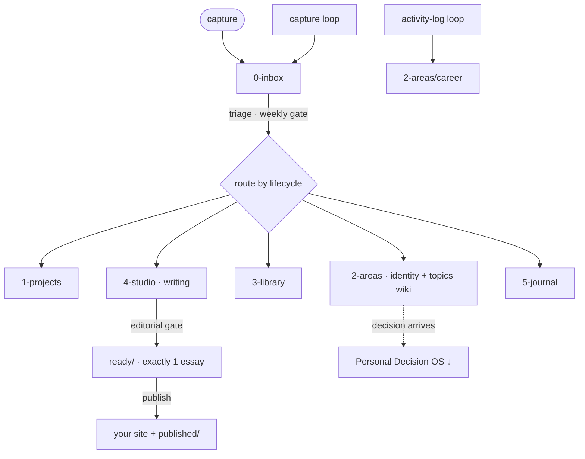
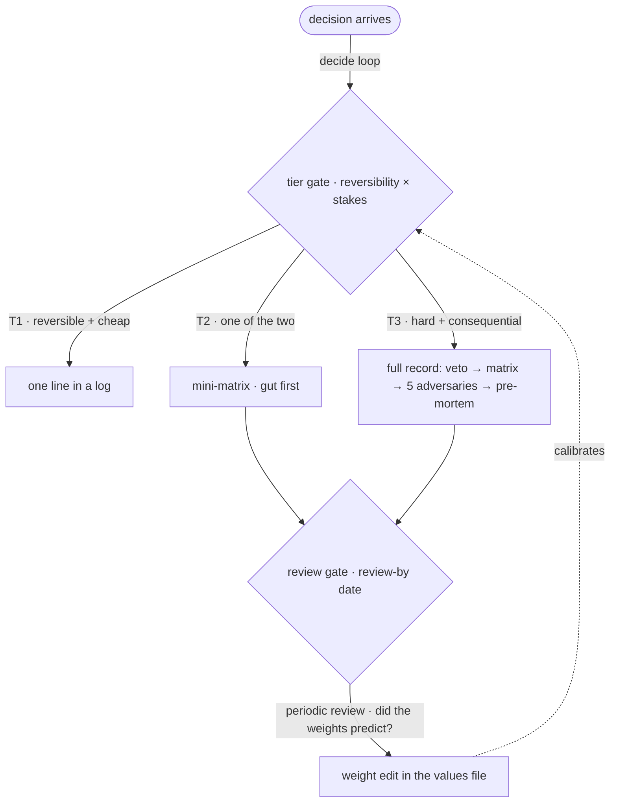

# System map

How the pieces connect. In the live vault two dashboards do different jobs: an *operational* one (what's owed right now — health, inbox, pipeline) and this *architectural* one (how the machine is wired). This is the architecture view.

## The three systems

Each system = an operating doc (how) + a decision record (why) + its machinery.

| System | Runs | Operating doc | Decision record |
|---|---|---|---|
| **Second Brain OS** — the vault itself | capture → route → ship | [GUIDE.md](../GUIDE.md) | founding ADR |
| **Writing pipeline** — the publishing valve | seedling → draft → ready → published | pipeline section + a Bases view | pipeline ADR |
| **Personal Decision OS** — life decisions | values → goals → decisions → reviews | decision-OS setup guide | decision-OS ADR |

## Flow — the loops and where they gate

## Flow — the Decision OS gates

*Two rules the gates enforce: the gut call is recorded before the matrix totals are visible; weight edits happen only at the review gate, never mid-decision.*

## Two layered principles

- **Retrieval over conditioning.** The identity/self layer is loaded *through* a gate when a task calls for it — never nailed into every turn as a standing profile. A self-model that conditions every answer makes the agent regress to a stale average; one retrieved on demand is just context.
- **Decision records as a decision journal.** Reasoning recorded *in advance* and reviewed on a schedule is the forcing function that keeps a self-layer honest — it corrects the self-story instead of letting it fossilize into a "mausoleum of old selves."
